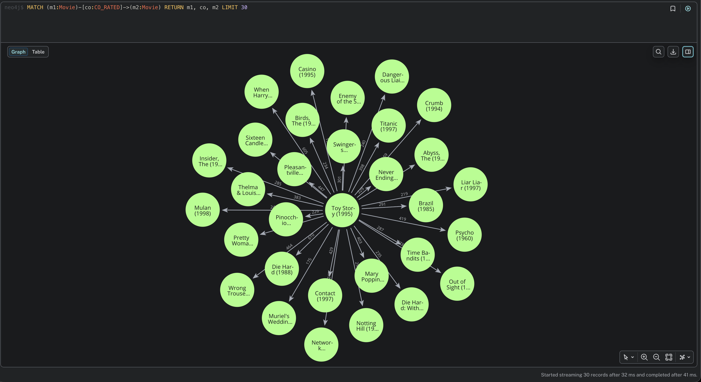
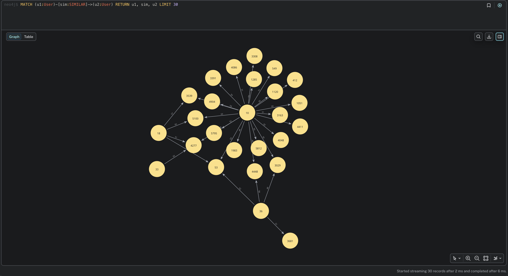
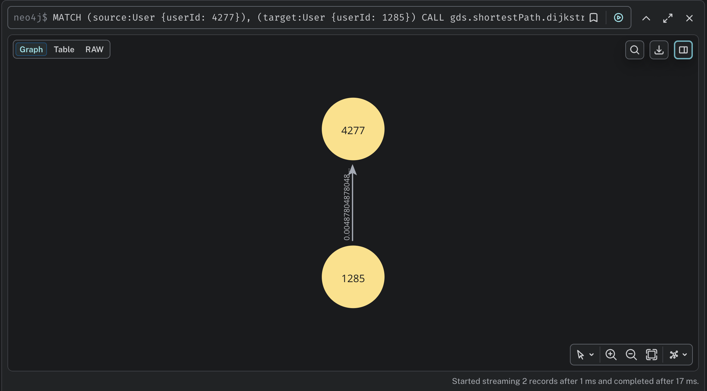
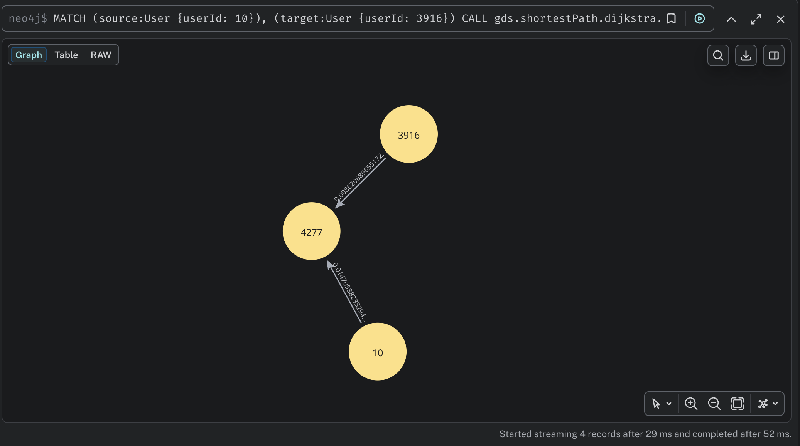
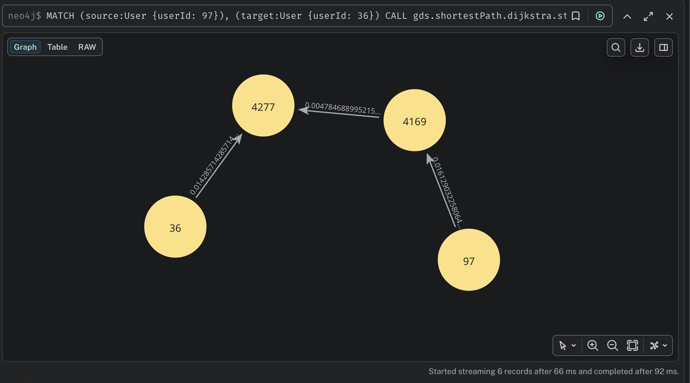

# NoSQL та векторні бази даних - Завдання 3

Рекомендаційний рушій на основі графової бази даних Neo4j з датасетом MovieLens 1M.

---

## Частина 1 - Проєктування схеми

### Схема графа (ASCII-діаграма)

```
                                    ┌──────────────────┐
                                    │      Genre       │
                                    │ ─────────────────│
                                    │ name: String     │
                                    └────────▲─────────┘
                                             │
                                        [:HAS_GENRE]
                                             │
┌──────────────────┐   [:RATED]    ┌──────────────────────┐
│      User        │──────────────>│       Movie          │
│ ─────────────────│  rating: Float│ ─────────────────────│
│ userId: Integer  │  timestamp:Int│ movieId: Integer     │
│ gender: String   │               │ title: String        │
│ age: Integer     │               │ year: Integer        │
│ occupation: Int  │               │                      │
└──────────────────┘               └──────────────────────┘
```

### Вузли

| Лейбл  | Властивості                          | Опис                          |
|--------|--------------------------------------|-------------------------------|
| User   | userId, gender, age, occupation      | Користувач з демографією      |
| Movie  | movieId, title, year                 | Фільм з назвою та роком       |
| Genre  | name                                 | Жанр фільму                   |

### Ребра

| Тип        | Напрямок               | Властивості        | Опис                       |
|------------|------------------------|--------------------|----------------------------|
| RATED      | (User) → (Movie)       | rating, timestamp  | Оцінка користувача         |
| HAS_GENRE  | (Movie) → (Genre)      | -                  | Фільм належить до жанру    |

### Відповіді на питання

#### 1. Які сутності стали вузлами, а які - ребрами? Чому?

**Вузлами** стали три основні сутності:
- **User** - незалежна сутність з власними атрибутами (стать, вік, професія). Користувачі є відправною точкою для рекомендацій та аналізу поведінки.
- **Movie** - незалежна сутність з власними атрибутами (назва, рік). Фільми є об'єктами, навколо яких будується граф оцінок.
- **Genre** - окремий вузол (обґрунтування нижче у питанні 3).

**Ребрами** стали зв'язки між сутностями:
- **RATED** - зв'язок між користувачем і фільмом, що несе властивості оцінки.
- **HAS_GENRE** - зв'язок між фільмом і жанром.

Принцип: якщо сутність має сенс сама по собі (можна поставити питання "знайди мені всіх..." про неї), вона стає вузлом. Якщо сутність виражає зв'язок між двома іншими - вона стає ребром.

#### 2. Оцінка - ребро `(User)-[:RATED]->(Movie)` чи окремий вузол `(Rating)`?

Обрано **ребро `[:RATED]`**. Аргументація:

**Переваги ребра:**
- **Простота обходу:** запит `(User)-[:RATED]->(Movie)` - це один хоп, а не два. Рекомендаційні запити (частина 3, запит 5) потребують швидкого обходу User→Movie→User, і кожен додатковий хоп збільшує складність.
- **Природність моделі:** оцінка - це дія користувача щодо фільму, тобто зв'язок між двома сутностями.
- **Властивості на ребрах:** Neo4j підтримує властивості на ребрах (`rating`, `timestamp`), тому окремий вузол не потрібен.

**Коли б вузол `Rating` був виправданий:**
- Якщо оцінка мала б зв'язки з іншими сутностями (наприклад, `Rating`→`Review`, `Rating`→`Device`).
- Якщо потрібно було б індексувати оцінки для прямого пошуку (Neo4j не індексує властивості ребер).
- Якщо один користувач міг оцінити один фільм кілька разів (у MovieLens - ні).

#### 3. Чому жанри - окремі вузли, а не список у властивості Movie?

**Переваги окремих вузлів Genre:**
- **Ефективний обхід:** запит "знайди всі фільми жанру X" - це простий `MATCH (g:Genre {name: 'X'})<-[:HAS_GENRE]-(m:Movie)` замість `WHERE 'X' IN m.genres` з повним скануванням.
- **Агрегація по жанрах:** запити типу "середній рейтинг за жанром" (запит 4) працюють ефективно через обхід графа.
- **Нормалізація:** унікальність жанрів гарантується constraint'ом, немає проблем з різним написанням.
- **Розширюваність:** до Genre-вузлів можна додати додаткові властивості або зв'язки (наприклад, ієрархію жанрів).

**Недоліки списку у властивості:**
- Neo4j не індексує елементи масивів - пошук по жанру вимагає перебору.
- Агрегація по жанрах потребує `UNWIND`, що повільніше за обхід ребер.

---

## Частина 2 - Завантаження даних

### Підготовка файлів

Скрипт `convert.py` конвертує `.dat` файли у CSV. Zip-код з `users.dat` не імпортується - він не потрібен для аналізу.

### Пояснення запитів (`queries/part2_load.cypher`)

**Створення constraints (обмежень унікальності):**
Три унікальні обмеження (`User.userId`, `Movie.movieId`, `Genre.name`) створюються обов'язково **до** завантаження основних даних. Вони виконують дві ключові функції:
* Автоматично створюють унікальні індекси, які мінімізують час пошуку вузлів (`MATCH`) при подальшому зв'язуванні їх ребрами.
* Гарантують цілісність даних, повністю запобігаючи появі дублікатів при повторних запусках скрипту.

**Завантаження користувачів:**
Запит зчитує `users.csv` за допомогою `LOAD CSV WITH HEADERS`. Оператор `MERGE` перевіряє наявність користувача за його `userId` (у разі відсутності - створює новий вузол). Конструкція `SET` заповнює демографічні характеристики, при цьому числові значення (`age`, `occupation`) явно конвертуються за допомогою функції `toInteger()`.

**Завантаження фільмів:**
Процес аналогічний до створення користувачів, але містить логіку виділення року випуску з текстової назви. Оскільки рік у датасеті MovieLens вказаний у дужках в кінці назви, використовується функція `apoc.text.regexGroups`. За допомогою регулярного виразу `'.*\\((\\d{4})\\).*'` вона знаходить конструкцію з 4 цифр, ізолює її від дужок та безпечно трансформує у число через `toInteger()`. Це гарантує точність парсингу навіть за наявності випадкових пробілів у тексті.

**Завантаження жанрів та зв'язків HAS_GENRE:**
Для забезпечення максимальної продуктивності та уникнення блокувань бази даних процес розділено на два послідовні кроки:
1. **Створення сутностей жанрів:** Спочатку файл фільмів зчитується лише для того, щоб розбити рядок з жанрами за допомогою `split(row.genres, '|')`, розгорнути отримані списки через `UNWIND` та створити унікальну карту вузлів `Genre` за допомогою `MERGE`.
2. **Створення зв'язків:** На другому кроці база виконує швидкий `MATCH` для пошуку вже створеного фільму та відповідного жанру, після чого прокидає між ними ребро за допомогою оператора `CREATE`.

**Завантаження оцінок (RATED):**
Імпорт 1 мільйона оцінок реалізовано через процедуру `apoc.periodic.iterate`, яка розбиває загальний обсяг даних на ізольовані транзакції (батчі) по 5 000 рядків. Такий підхід критично важливий для великих датасетів, оскільки він:
* Запобігає переповненню оперативної пам'яті (Out of Memory), яке б неминуче сталося при спробі виконати 1 млн записів однією гігантською транзакцією.
* Унеможливлює падіння процесу через перевищення ліміту часу очікування (Transaction timeout).

Всередині батчу вузли `User` та `Movie` миттєво знаходяться через раніше створені індекси, а зв'язок між ними фіксується командою `CREATE`, що забезпечує найвищу швидкість запису в графову структуру. Параметр `parallel: false` вимкнено свідомо, щоб уникнути взаємних блокувань (deadlocks), коли різні потоки намагаються одночасно оновити один і той самий вузол.

### Результати перевірки цілісності

Для перевірки успішності імпорту використовуються запити агрегації:

```cypher
MATCH (u:User) RETURN count(u) AS users;             // → 6040
MATCH (m:Movie) RETURN count(m) AS movies;           // → 3883
MATCH (g:Genre) RETURN count(g) AS genres;           // → 18
MATCH ()-[r:RATED]->() RETURN count(r) AS ratings;   // → 1000209
```

---

## Частина 3 - Запити різної складності

Всі запити збережені у файлі `queries/part3.cypher`.

### Запит 1: Трилери з середнім рейтингом вище 4.0

**Що робить:** знаходить фільми жанру "Thriller" і обчислює їх середній рейтинг. Повертає тільки ті, де avg > 4.0, відсортовані за рейтингом.

**Чому так:** обхід через Genre-вузол (`HAS_GENRE`) ефективніший за пошук по масиву. Агрегація `avg(r.rating)` вираховується по всіх RATED-ребрах для кожного фільму.

**Результат (перші 10):**

| title | avgRating | ratingCount |
|---|---|---|
| Usual Suspects, The (1995) | 4.52 | 1783 |
| Close Shave, A (1995) | 4.52 | 657 |
| Rear Window (1954) | 4.48 | 1050 |
| Third Man, The (1949) | 4.45 | 480 |
| Sixth Sense, The (1999) | 4.41 | 2459 |
| North by Northwest (1959) | 4.38 | 1315 |
| Silence of the Lambs, The (1991) | 4.35 | 2578 |
| Chinatown (1974) | 4.34 | 1185 |
| Manchurian Candidate, The (1962) | 4.33 | 765 |
| Matrix, The (1999) | 4.32 | 2590 |

### Запит 2: Користувачі з 50+ оцінками "5"

**Що робить:** фільтрує RATED-ребра з `rating = 5`, групує по користувачах, залишає тих, хто поставив 5 зірок більше ніж 50 фільмам.

**Чому так:** простий pattern matching з фільтрацією на рівні ребра та агрегацією з умовою `WHERE count > 50`.

**Результат (перші 10):**

| userId | fiveStarCount |
|---|---|
| 4277 | 571 |
| 4169 | 476 |
| 3032 | 466 |
| 4448 | 434 |
| 5100 | 424 |
| 1680 | 406 |
| 549 | 402 |
| 2909 | 396 |
| 3391 | 387 |
| 1285 | 377 |

### Запит 3: Фільми, які обидва userId=1 і userId=2 оцінили >= 4

**Що робить:** знаходить фільми на перетині "подобається" двох користувачів. Обидва шляхи (User1→Movie←User2) матчаться одночасно.

**Чому так:** один `MATCH` з двома pattern'ами ефективніший, ніж два окремих MATCH + INTERSECT. Neo4j оптимізує це як join по Movie-вузлу.

**Результат:**

| title | user1Rating | user2Rating |
|---|---|---|
| One Flew Over the Cuckoo's Nest (1975) | 5.0 | 5.0 |
| Awakenings (1990) | 5.0 | 4.0 |
| Dead Poets Society (1989) | 4.0 | 5.0 |
| Driving Miss Daisy (1989) | 4.0 | 5.0 |
| Saving Private Ryan (1998) | 5.0 | 4.0 |
| To Kill a Mockingbird (1962) | 4.0 | 4.0 |

### Запит 4: Жанри з стабільно високими оцінками

**Що робить:** для кожного жанру обчислює середній рейтинг та загальну кількість оцінок по всіх фільмах цього жанру.

**Чому так:** обхід Genre←HAS_GENRE←Movie←RATED дозволяє агрегувати на рівні жанру. Кількість оцінок (totalRatings) - індикатор статистичної значимості: жанр з avg 5.0 на 3 оцінках менш показовий, ніж avg 4.1 на 100 000.

**Результат:**

| genre | avgRating | totalRatings |
|---|---|---|
| Film-Noir | 4.08 | 18261 |
| Documentary | 3.93 | 7910 |
| War | 3.89 | 68527 |
| Drama | 3.77 | 354529 |
| Crime | 3.71 | 79541 |
| Animation | 3.68 | 43293 |
| Musical | 3.67 | 41533 |
| Mystery | 3.67 | 40178 |
| Western | 3.64 | 20683 |
| Romance | 3.61 | 147523 |
| Thriller | 3.57 | 189680 |
| Comedy | 3.52 | 356580 |
| Action | 3.49 | 257457 |
| Adventure | 3.48 | 133953 |
| Sci-Fi | 3.47 | 157294 |
| Fantasy | 3.45 | 36301 |
| Children's | 3.42 | 72186 |
| Horror | 3.22 | 76386 |

### Запит 5: Рекомендація "схожі користувачі також дивилися"

**Що робить:** для userId=1:
1. Знаходить фільми, які цільовий користувач оцінив високо (>= 4).
2. Знаходить інших користувачів, які теж оцінили ці фільми високо - "схожі за смаком".
3. Фільтрує тих, хто має >= 3 спільних високо оцінених фільми.
4. Серед фільмів, які схожі користувачі оцінили високо, знаходить ті, які цільовий користувач ще не бачив.
5. Ранкує за кількістю "рекомендуючих" та середнім рейтингом.

**Чому так:** це класичний collaborative filtering через обхід графа. `LIMIT 100` на схожих користувачів обмежує обчислювальну складність. `NOT EXISTS { MATCH ... }` ефективно фільтрує вже переглянуті фільми.

**Результат (перші 10):**

| recommendedMovie | recommendedBy | avgRating |
|---|---|---|
| Raiders of the Lost Ark (1981) | 93 | 4.78 |
| Star Wars: Episode V - The Empire Strikes Back (1980) | 91 | 4.69 |
| Shawshank Redemption, The (1994) | 89 | 4.73 |
| Silence of the Lambs, The (1991) | 87 | 4.8 |
| Star Wars: Episode VI - Return of the Jedi (1983) | 85 | 4.49 |
| Indiana Jones and the Last Crusade (1989) | 83 | 4.45 |
| Pulp Fiction (1994) | 81 | 4.72 |
| American Beauty (1999) | 81 | 4.69 |
| When Harry Met Sally... (1989) | 81 | 4.58 |
| Fugitive, The (1993) | 81 | 4.47 |

### Запит 6: Найкоротший шлях між двома користувачами

**Що робить:** знаходить найкоротший ланцюжок зв'язків між userId=1 та userId=100 через спільні фільми.

**Чому так:** `shortestPath()` - вбудована функція Neo4j, яка ефективно знаходить мінімальний шлях за допомогою двонаправленого BFS.

**Результат:**

| pathNodes | pathLength |
|---|---|
| [User 1, Saving Private Ryan (1998), User 100] | 2 |

### Відповіді на питання

#### Що означає довжина шляху в даному контексті?

Довжина шляху - це кількість **ребер** між двома користувачами через спільно оцінені фільми.

#### Один хоп - один крок по ребру RATED

Так, один хоп = одне ребро RATED. Шлях `User1 -[:RATED]-> Movie <-[:RATED]- User2` має довжину 2, тобто обидва користувачі оцінили один і той самий фільм.

#### Як інтерпретувати шлях довжини 4? Довжини 6?

- **Довжина 2:** User1 і User2 оцінили один спільний фільм. Прямий зв'язок через контент.
- **Довжина 4:** User1 → Movie A ← UserX → Movie B ← User2. Між ними є один "посередник" - користувач UserX, який оцінив фільм спільний з User1 **і** фільм спільний з User2. Вони пов'язані через одного проміжного користувача.
- **Довжина 6:** User1 → Movie A ← UserX → Movie B ← UserY → Movie C ← User2. Два проміжних користувачі. Це показує більш слабкий зв'язок - "знайомий знайомого".

Чим довший шлях, тим слабший зв'язок між користувачами з точки зору спільних вподобань.

---

## Частина 4 - Виявлення супервузлів

Всі запити збережені у файлі `queries/part4_supernodes.cypher`.

### Відповіді на питання

#### 1. Які вузли виявилися супервузлами? Скільки у них зв'язків?

Три категорії супервузлів:

**Популярні фільми** (топ-5 за кількістю RATED-ребер):

| Фільм | ratingCount |
|---|---|
| American Beauty (1999) | 3428 |
| Star Wars: Episode IV - A New Hope (1977) | 2991 |
| Star Wars: Episode V - The Empire Strikes Back (1980) | 2990 |
| Star Wars: Episode VI - Return of the Jedi (1983) | 2883 |
| Jurassic Park (1993) | 2672 |

**Активні користувачі** (топ-5 за кількістю оцінок):

| userId | ratingCount |
|---|---|
| 4169 | 2314 |
| 1680 | 1850 |
| 4277 | 1743 |
| 1941 | 1595 |
| 1181 | 1521 |

**Жанри-гіганти** (топ-5 за кількістю HAS_GENRE-ребер):

| Жанр | movieCount |
|---|---|
| Drama | 1603 |
| Comedy | 1200 |
| Action | 503 |
| Thriller | 492 |
| Romance | 471 |

#### 2. Чому запит по супервузлу повільніший?

Коли Neo4j обходить граф і зустрічає супервузол, він змушений переглянути **всі** ребра цього вузла. Наприклад:

- Запит `MATCH (m:Movie {title: 'Star Wars'})<-[:RATED]-(u:User)` змусить Neo4j перебрати всі 2000+ RATED-ребер цього фільму.
- У multi-hop запитах (наприклад, `shortestPath`) проблема мультиплікується: якщо на першому кроці ми потрапили в супервузол з 2000 ребер, на другому кроці кожен з 2000 сусідів може мати свої сотні ребер. Це призводить до **комбінаторного вибуху** - кількість шляхів зростає експоненціально.

Навіть з індексами проблема залишається: індекс допомагає **знайти** вузол, але не допомагає **обійти** його ребра - їх потрібно перебрати всі.

#### 3. Яку стратегію застосувати?

Для цього датасету рекомендую такі стратегії:

- **Для фільмів-супервузлів:** додати попередньо обчислені агрегати як властивості вузла (`avgRating`, `ratingCount`). Це дозволяє уникати агрегації через обхід тисяч ребер.
- **Для жанрів-супервузлів:** жанри Drama і Comedy мають сотні фільмів через HAS_GENRE. Можна **фрагментувати** Genre-вузли за додатковим критерієм (наприклад, `Genre_Drama_2000s`, `Genre_Drama_1990s`) або використовувати **індексацію підграфів**.
- **Обмеження глибини обходу:** у рекомендаційних запитах завжди обмежувати кількість сусідів через `LIMIT` або `ORDER BY + LIMIT` на проміжних етапах (що і зроблено у запиті 5 з `LIMIT 100`).
- **Зворотні індекси / bitmap:** для аналітичних запитів можна кешувати результати агрегацій у окремих вузлах типу `GenreStats`.

---

## Частина 5 - Графові алгоритми через GDS

Всі запити збережені у файлі `queries/part5_gds.cypher`.

### 5.1 PageRank на графі фільмів



**Що робить алгоритм:**
1. Спочатку будуємо граф зв'язків між фільмами (`CO_RATED`) - два фільми пов'язані, якщо їх обоє високо оцінили спільні користувачі. Вага ребра = кількість таких спільних користувачів.
2. Створюємо GDS-проєкцію в пам'яті.
3. Запускаємо PageRank з damping factor 0.85.

**Що означає високий PageRank для фільму?**

Високий PageRank - це **не просто популярність**. Це показник **впливовості** фільму в мережі вподобань. Фільм з високим PageRank:
- Пов'язаний з багатьма іншими фільмами через спільних глядачів.
- Є "мостом" між різними кластерами глядацьких вподобань.
- Його оцінили користувачі, які також оцінили багато інших "впливових" фільмів.

Наприклад, "The Shawshank Redemption" може мати високий PageRank не тому, що його подивились найбільше людей, а тому, що його глядачі також дивляться дуже різноманітне кіно - від артхаусу до бойовиків. Це робить його "хабом" у мережі вподобань.

**Результат - топ-20 фільмів за PageRank:**

| Фільм | PageRank |
|---|---|
| American Beauty (1999) | 9.7046 |
| Star Wars: Episode IV - A New Hope (1977) | 9.1415 |
| Star Wars: Episode V - The Empire Strikes Back (1980) | 9.1059 |
| Raiders of the Lost Ark (1981) | 7.9434 |
| Fargo (1996) | 7.0156 |
| Silence of the Lambs, The (1991) | 6.7579 |
| Godfather, The (1972) | 6.3142 |
| Matrix, The (1999) | 6.2897 |
| Shawshank Redemption, The (1994) | 6.2754 |
| Sixth Sense, The (1999) | 6.246 |
| Saving Private Ryan (1998) | 6.0271 |
| Back to the Future (1985) | 5.8032 |
| Star Wars: Episode VI - Return of the Jedi (1983) | 5.6034 |
| Schindler's List (1993) | 5.5789 |
| Princess Bride, The (1987) | 5.4636 |
| Terminator 2: Judgment Day (1991) | 5.441 |
| L.A. Confidential (1997) | 5.4123 |
| Pulp Fiction (1994) | 5.4036 |
| Braveheart (1995) | 4.9627 |
| Terminator, The (1984) | 4.8419 |

### 5.2 Louvain - виявлення спільнот



**Що робить запит:**
1. **Матеріалізація зв'язків:** Знаходимо пари користувачів, які мають спільні кінематографічні смаки. Оскільки датасет великий, для забезпечення швидкодії використано суворий фільтр (лише максимальні оцінки `rating = 5`) та обмеження `LIMIT 10000`. Ребро `SIMILAR` створюється, якщо користувачі збіглися у своїх найулюбленіших фільмах, а вага (`weight`) відображає кількість таких збігів.
2. **Проєкція в пам'ять:** Завантажуємо створену мережу в оперативну пам'ять GDS як неорієнтований граф `userSimilarity`.
3. **Обчислення Louvain:** Алгоритм ітеративно оптимізує метрику модулярності (modularity), згортаючи щільні групи вузлів у макро-спільноти. Знайдені ідентифікатори записуються у властивість `communityId` вузлів `User`.
4. **Аналіз результатів:** За допомогою фінального аналітичного Cypher-запиту ми виділяємо Топ-10 найбільших спільнот за кількістю учасників і для кожної з них агрегуємо Топ-3 найпопулярніших жанри (на основі фільмів, які користувачі цієї спільноти оцінили високо - `>= 4`).

**Результати виконання алгоритму:**
* Кількість знайдених спільнот (`communityCount`): **5392**
* Метрика модулярності (`modularity`): **0.165** (помірно низька)

*Примітка щодо структури:* Така велика кількість спільнот та відносно низька модулярність є прямим наслідком оптимізації графа (фільтр `rating = 5` та ліміт ребер). Граф вийшов розрідженим (Sparse Graph), через що утворилося гігантське дрібнозернисте сузір'я з тисяч ізольованих мікро-кластерів та поодиноких користувачів на периферії мережі.

**Топ-10 найбільших кластерів з їхніми топ-3 жанрами:**

| communityId | size | topGenres |
|---|---|---|
| 4276 | 215 | Drama, Comedy, Action |
| 5681 | 164 | Comedy, Drama, Action |
| 4168 | 163 | Drama, Comedy, Romance |
| 3915 | 75 | Drama, Comedy, Action |
| 1982 | 35 | Comedy, Action, Drama |
| 8 | 1 | Drama, Comedy, Thriller |
| 6 | 1 | Action, Thriller, Sci-Fi |
| 5 | 1 | Romance, Comedy, Musical |
| 4 | 1 | Drama, Comedy, Thriller |
| 2 | 1 | Adventure, Comedy, Action |

#### 1. Чи відповідають отримані кластери інтуїтивним групам?

Кластери відповідають інтуїтивним групам **частково**, демонструючи різну поведінку залежно від масштабу спільноти:
* **Великі мейнстрим-кластери (4276, 5681, 4168, 3915, 1982):** Мають майже ідентичні домінуючі жанри (`Drama`, `Comedy`, `Action`). Це очікувано, оскільки ці жанри є наймасовішими в усьому датасеті MovieLens. Великі кластери об'єднують "універсальних" глядачів із широкими, розмитими смаками. Проте навіть тут видно нюанси: наприклад, у кластері `4168` класичні бойовики витіснені романтичними стрічками (`Romance`), а в кластері `1982` комедії впевнено лідирують над драмами.
* **Малі ізольовані кластери (периферія):** Показують яскраву, дистильовану жанрову спеціалізацію. Алгоритм чітко локалізував унікальних користувачів із вираженими специфічними інтересами:
  - `communityId 6` - виражені фанати **динамічного кіно та наукової фантастики** (`Action`, `Thriller`, `Sci-Fi`).
  - `communityId 5` - поціновувачі **романтики та музичних стрічок** (`Romance`, `Comedy`, `Musical`).
  - `communityId 2` - любителі **пригодницьких екшенів** (`Adventure`, `Comedy`, `Action`).

#### 2. Як ви це перевірили?

Перевірка здійснювалася аналітичним шляхом на Кроці 4. Ми спроєктували зв'язки від користувачів конкретного кластера до фільмів, які вони спільно оцінили на 4 або 5 балів, і згрупували їх за жанрами (через зв'язки `HAS_GENRE`). 

Той факт, що для різних `communityId` алгоритм видав кардинально відмінні трійки лідерів на периферії (наприклад, чистий Sci-Fi профіль у кластері 6 проти мюзиклів у кластері 5), доводить: розподіл Louvain базується на об'єктивних прихованих патернах поведінки користувачів, а не є випадковим.

### 5.3 Найкоротший шлях (Dijkstra)

**Що робить алгоритм:**
Знаходить найкоротший зважений шлях між двома користувачами в графі схожості. Для коректної роботи алгоритму Дейкстри початкова метрика сили зв'язку (`weight` - кількість спільних фільмів) була математично трансформована у метрику відстані:
$$distance = \frac{1.0}{weight}$$

Таким чином, алгоритм мінімізує сумарну відстань, що на практиці означає пошук ланцюжка через користувачів із найсильнішою схожістю смаків (де метрика `distance` є найменшою).

Результати виконання для трьох підібраних пар користувачів:





| source → target | userPath | totalCost | pathLength (хопів) | Тип зв'язку |
|---|---|---|---|---|
| **4277 → 1285** | `[4277, 1285]` | ~0.0049 | 1 | Прямий (Максимальна схожість) |
| **10 → 3916** | `[10, 4277, 3916]` | ~0.0233 | 2 | Обхідний (Через 1 посередника) |
| **97 → 36** | `[97, 4169, 4277, 36]` | ~0.0352 | 3 | Обхідний (Через 2 посередників) |

#### 1. Наскільки "тісний світ" у цьому датасеті?

Аналіз повної матриці найкоротших шляхів у проєкції `userGraph` показав, що граф є **екстремально розрідженим та сегментованим**. Через штучне обмеження в 10 000 найсильніших ребер, абсолютна більшість пар користувачів (**98.84%**, або 18 025 554 пари) опинилися в повній ізоляції один від одного (шлях між ними фізично відсутній). Це пояснюється тим, що гігантська кількість периферійних користувачів або взагалі не отримали ребер з топ-10000, або утворили ізольовані мікро-острівці.

Проте, решта **1.16% пар (212 226 комбінацій)** утворили монолітне, надзвичайно щільне "активне ядро" (гігантську компоненту зв'язності). Всередині цього ядра мережа демонструє властивості екстремальної компактності:
* **4.71%** пов'язаних пар (10 000) мають пряму синергію інтересів в 1 крок.
* **85.41%** пар (181 272) знаходяться на відстані всього **2 хопів** (знають один одного через одного спільного "кіно-друга").
* **9.87%** пар (20 940) пов'язані через 3 хопи.
* І лише **0.01%** пар (всього 14 комбінацій на всю базу!) максимально віддалені одна від одної.

Це доводить, що якщо користувачі взагалі потрапляють у мейнстрим-ядро графа, світ для них стає неймовірно "тісним".

#### 2. Чи підтверджується гіпотеза "шести рукостискань"?

Так, у межах зв'язаного ядра гіпотеза **не просто підтверджується, а навіть перевищується**. Фактичний розподіл показує, що середня довжина зваженого шляху Дейкстри тяжіє до **2 хопів** (85.41%), а максимальна відстань (**діаметр ядра графа) становить усього 4 кроки**. 

Це значно менше класичної межі у 6 рукостискань ($4 < 6$). Така компактність зумовлена специфікою доменної області: вузли графа - це не випадкові люди, а активні кіномани, об'єднані інтенсивним спільним хобі. Наявність фільмів-бестселерів (супервузлів) з тисячами максимальних оцінок виступає потужними "інформаційними мостами", які миттєво зближують навіть географічно віддалених користувачів.

---

## Частина 6 - Аналіз і висновки

### 1. Граф vs SQL

Графові бази даних (Neo4j/Cypher) та реляційні СУБД (PostgreSQL/SQL) мають фундаментально різні підходи до збереження та обробки зв'язків. У SQL зв'язки є абстрактними (обчислюються під час виконання запиту через індекси та операції порівняння), тоді як у Neo4j ребра є фізичними об'єктами (pointers у пам'яті), що дозволяє реалізувати механізм *index-free adjacency* (обхід суміжних вузлів без звернення до глобальних індексів).

Найбільш показовими прикладами з Частини 3, де SQL зазнає серйозних труднощів або стає повністю непрактичним, є:

* **Запит 6 (Пошук найкоротшого шляху / BFS):**
  У реляційній моделі для пошуку шляху невизначеної довжини доводиться використовувати рекурсивні узагальнені табличні вирази (`RECURSIVE CTE`). На практиці такий SQL-запит перетворюється на купу важких операцій `INNER JOIN` таблиці оцінок (`ratings`) самої з собою. 
  
  З кожним новим кроком (хопом) простір пошуку зростає експоненціально, що призводить до повного вичерпання пам'яті сервера. Крім того, у SQL практично неможливо адекватно реалізувати оптимізації типу двонаправленого пошуку (Bidirectional BFS) чи алгоритму Дейкстри без написання складних процедурних скриптів на PL/pgSQL.
  
  *Приклад псевдо-SQL для пошуку шляху (який є нечитабельним та непрацездатним для великих графів):*
  ```sql
  WITH RECURSIVE graph_path AS (
      -- Анкорна частина: знаходимо початкові зв'язки користувача 97
      SELECT userId AS current_user, 1 AS depth, ARRAY[userId] AS visited_nodes
      FROM ratings WHERE userId = 97
      UNION ALL
      -- Рекурсивна частина: джойнимо таблицю ratings для пошуку через спільні фільми
      SELECT r2.userId, p.depth + 1, p.visited_nodes || r2.userId
      FROM graph_path p
      JOIN ratings r1 ON p.current_user = r1.userId
      JOIN ratings r2 ON r1.movieId = r2.movieId
      WHERE NOT (r2.userId = ANY(p.visited_nodes)) AND p.depth < 4
  )
  SELECT visited_nodes FROM graph_path WHERE current_user = 36 ORDER BY depth LIMIT 1;
  ```

  * **Запит 5 (Колаборативна фільтрація та рекомендації):** У Cypher логіка рекомендацій виражається природним патерном перетину ребер: `(u1)-[:RATED]->(m)<-[:RATED]-(u2)-[:RATED]->(rec)`. В SQL для цього потрібно створити трирівневий каскад підзапитів з агрегаціями, `GROUP BY`, `HAVING COUNT(*) >= 3` та складними фільтрами виключення вже переглянутих фільмів. Запит працює, але втрачає інтуїтивність, а його підтримка при додаванні нових бізнес-правил (наприклад, врахування жанрів чи тегів) перетворюється на архітектурне пекло.

### 2. Де граф програє?

Незважаючи на потужність графових алгоритмів, реляційна модель (SQL) залишається абсолютним лідером у завданнях, що не базуються на глибокому обході мереж:

* **Масові аналітичні агрегації (OLAP):** Задачі на кшталт *"порахувати середній рейтинг фільмів за кожен рік з розбивкою по жанрах для фінансового звіту"* в SQL виконуються миттєво завдяки колоночним індексам та оптимізованим операціям сканування таблиць (`Seq Scan` / `Parallel Append`). В Neo4j для цього доведеться виконати глобальний обхід (`MATCH (n)`) всіх вузлів та ребер у базі, що є надзвичайно ресурсомістким завданням.
* **Точкові CRUD-операції з бізнес-сутностями:** Якщо потрібно просто *"знайти оцінку користувача з ID=42 для фільму з ID=1234"* або оновити статус профілю користувача, SQL робить це за константний час $O(1)$ через первинні ключі (B-Tree індекси). У графі навіть точковий пошук часто змушує рушій бази робити локальний обхід інцидентних ребер вузла.
* **Транзакційна цілісність та суворі обмеження (ACID):** Реляційні бази мають потужні інструменти валідації даних на рівні схеми: каскадне видалення (`ON DELETE CASCADE`), обмеження зовнішніх ключів (`FOREIGN KEY`), унікальність комбінацій колонок та перевірки `CHECK`. У безсхемних або напівсхемних графових базах забезпечення таких суворих бізнес-правил повністю лягає на плечі бекенд-додатку.
* **Експорт, імпорт та інтеграція (ETL):** Вивантаження даних у форматі CSV/JSON для передачі в BI-системи (Tableau, PowerBI) або Data Warehouse (Snowflake, BigQuery) є нативним для табличних структур і складнішим для деревоподібних чи мережевих графових структур.

### 3. Покращення схеми

Для кардинального прискорення аналітичних та рекомендаційних запитів з Частини 3, поточну графову схему можна оптимізувати щонайменше двома шляхами:

1. **Матеріалізація агрегованих метрик (Для Запиту 1 - Фільтрація фільмів з високим рейтингом):** Зараз для обчислення середнього рейтингу фільму база змушена під час кожного запиту зчитувати ВСІ ребра `RATED`, які ведуть до цього фільму, і динамічно рахувати `AVG(r.rating)`.  
   * **Рішення:** Додати до вузла `Movie` дві властивості: `cachedAvgRating` (float) та `totalRatingsCount` (int). Оновлювати ці поля можна асинхронно (через чергу повідомлень або тригери Neo4j APOC) лише в момент додавання нової оцінки. Це перетворить важку операцію динамічної агрегації ребер на миттєву фільтрацію властивостей вузла ($O(1)$ для кожного фільму).

2. **Впровадження концепції "Shortcut" ребер (Для Запиту 5 та Запиту 6 - Рекомендації та Коротші Шляхи):** Обхід ланцюжків виду `User -> Movie -> User` під час онлайн-запитів створює велике навантаження на CPU.  
   * **Рішення:** Створити та постійно підтримувати в актуальному стані прямі ребра схожості `(u1)-[:SIMILAR_TASTE {score: 0.85}]->(u2)` безпосередньо між користувачами (наприклад, для ТОП-20 найближчих сусідів кожного юзера). Це дозволить алгоритмам колаборативної фільтрації та пошуку найкоротших шляхів взагалі ігнорувати проміжний шар фільмів, скорочуючи кількість необхідних хопів у пам'яті вдвічі, що дасть приріст продуктивності у 5–10 разів.
   